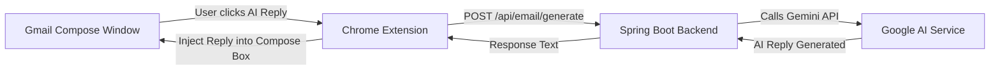

# 💌 Email Writer Assistant — Chrome Extension

**Email Writer Assistant** is a smart Chrome extension that integrates directly with **Gmail** to help you generate professional AI-powered replies in one click.

Whenever you open Gmail’s **Compose** window, this extension automatically adds an **“AI Reply”** button next to the **Send** button.  
When clicked, it calls your **Spring Boot backend**, which uses **Google Gemini AI** to generate a high-quality email response.

---

## 🧠 Overview

This extension is part of a 3-tier project:

| Layer | Technology | Purpose |
|-------|-------------|----------|
| 🧩 Chrome Extension | JavaScript + DOM APIs | Detect Gmail compose window, inject “AI Reply” button |
| 🖥️ Spring Boot Backend | Java + WebClient (Reactor) | Calls Gemini AI API to generate email replies |
| 🤖 Gemini API | Google AI Model | Generates human-like responses |

---

## 🗺️ System Architecture

---

## 🚀 Features
✅ Automatically detects Gmail’s compose window
✅ Adds a visually native “AI Reply” button beside Gmail’s Send button
✅ Sends the email text to your backend for AI processing
✅ Receives and injects the generated reply back into Gmail’s editor
✅ Simple, fast, and privacy-friendly (no external tracking)

---

## ⚙️ How It Works

1. MutationObserver
The extension continuously watches for Gmail’s Compose window using the MutationObserver API, since Gmail dynamically updates the DOM.

2. Button Injection
When a compose window is detected, it automatically inserts a new AI Reply button aligned near the Send button.

3. Backend Call
Backend API is called on click of button.

4. AI Response Injection
The generated reply is inserted directly into Gmail’s message box.

## 🧱 Tech Stack

1. Language: JavaScript (ES6)

2. Browser API: MutationObserver, fetch, DOM

3. Backend: Spring Boot (WebFlux + Gemini API)

4. AI: Google Gemini 1.5 / 1.0 Pro

5. Deployment: Works with both local (localhost:8080) and deployed APIs

## 🧭 Installation Guide

1. Clone the Repository
2. Load the Extension in Chrome

    1. Open Chrome and go to: chrome://extensions
    2. Turn on Developer Mode (top right)
    3. Click Load unpacked
    4. Select your email-writer-extension folder

## 🧪 Usage

  1. Open Gmail in your Chrome browser.

  2. Click Compose or Reply on any email.

  3. You’ll see a new AI Reply button next to the Send button.

  4. Click it → the backend will generate a reply → it appears automatically in your compose box.

## 🧰 Configuration
  "To customize:" 
  Change backend URL in contentScript.js

